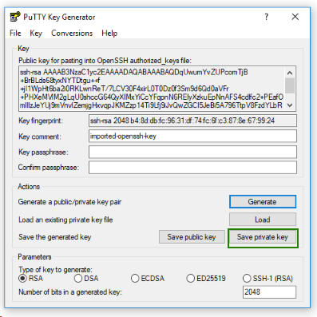

### Configure PuTTY for SSH Access

Get Key Location
```bash
vagrant ssh-config
```
 -  puttygen.exe   
`%USERPROFILE%\.vagrant.d\insecure_private_key to .ppk` 

File => Load Key   
Save Key => `private_key.ppk`      



Add Keys 
```bash
vagrant ssh-add "/../../virtualbox/private_key"
vagrant ssh control -- -A
```
### Troubleshooting SSH

```bash
vagrant ssh-config  -- list of keys displayed
ssh-add  /../../virtualbox/private_key

vagrant ssh control -- -A
ssh-add -l
```

Remove Keys    
```bash
rm -rf /home/ubuntu/.ansible/
```