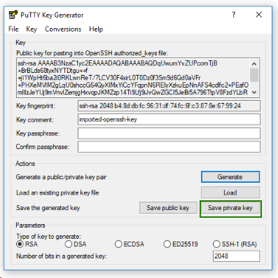

Typing `vagrant` from the command line will display a list of all available commands.

Be sure that you are in the same directory as the Vagrantfile when running these commands!

## Common Vagrant Commands
- `vagrant up`          -- starts vagrant environment (also provisions only on the FIRST vagrant up)
- `vagrant status`      -- outputs status of the vagrant machine
- `vagrant halt`        -- stops the vagrant machine
- `vagrant reload`      -- restarts vagrant machine, loads new Vagrantfile configuration
- `vagrant provision`   -- forces reprovisioning of the vagrant machine
- `vagrant ssh`         -- connects to machine via SSH
- `vagrant destroy`     -- stops and deletes all traces of the vagrant machine

## Tips
- `vagrant -v`                    -- Get the vagrant version
- `vagrant global-status`         -- outputs status of all vagrant machines
- `vagrant global-status --prune` -- same as above, but prunes invalid entries
- `vagrant suspend`               -- Suspends a virtual machine (remembers state)
- `vagrant resume`                -- Resume a suspended machine (vagrant up works just fine for this as well)
- `vagrant reload --provision`    -- Restart the virtual machine and force provisioning
- `vagrant provision --debug`     -- Use the debug flag to increase the verbosity of the output
- `vagrant push`                  -- Yes, vagrant can be configured to [deploy code](http://docs.vagrantup.com/v2/push/index.html)!
- `vagrant up --provision | tee provision.log`  -- Runs `vagrant up`, forces provisioning and logs all output to a file

## Installation

### Set Vagrant Home
```
setx VAGRANT_HOME "D:/Vagrant"
```

### Configure PuTTY for SSH Access

Get Key Location
```bash
vagrant ssh-config
```
 -  puttygen.exe   
`%USERPROFILE%\.vagrant.d\insecure_private_key to .ppk` 

File => Load Key   
Save Key => `private_key.ppk`      



Add Keys 
```bash
vagrant ssh-add "/../../virtualbox/private_key"
vagrant ssh control -- -A
```
### Troubleshooting SSH

```bash
vagrant ssh-config  -- list of keys displayed
ssh-add  /../../virtualbox/private_key

vagrant ssh control -- -A
ssh-add -l
```

Remove Keys    
```bash
rm -rf /home/ubuntu/.ansible/
```