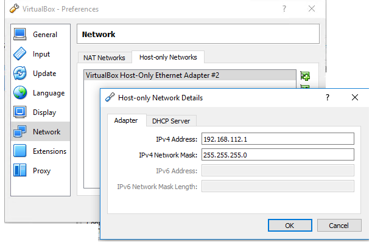

## Common VirualBox Commands

- `VBoxManage list vms` -- list vms
- `VBoxManage list runningvms` 
- `VBoxManage guestproperty get <usid|vname> "/VirtualBox/GuestInfo/Net/0/V4/IP"`  -- Getting the VM’s IP address
- `VBoxManage showvminfo <usid|vname> --details`

### Start/Stop

#### Start
- `VBoxManage startvm <usid|vname>` 
- `VBoxManage startvm <usid|vname> --type headless` 

#### Stop
- `VBoxManage controlvm <usid|vname> stop` 
- `VBoxManage unregistervm <usid|vname> --delete` -- Unregister/delete a VM
- `VBoxManage unregistervm <usid|vname> poweroff` -- Forcibly Shutdown a VM

###  Add Hardware storage components
- `VBoxManage storagectl <usid|vname> --add sata --name "SCSI Controller"`

### Installation

File => Preferences       

### Links

https://thornelabs.net/2015/08/24/virtualbox-commands-cheat-sheet.html      
http://it-ovid.blogspot.com/2012/10/virtual-box-headless-cheatsheet.html

